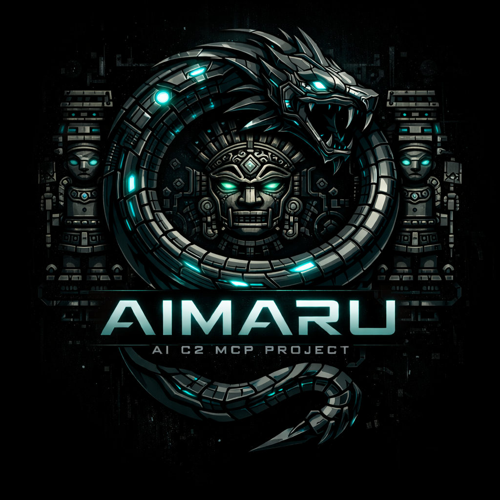

<div align="center">



# AIMARU MCP Platform

### AI-Powered Command & Control via Model Context Protocol

**Living Off the MCP** • **Autonomous Agentic Auto-Iteration** • **Military-Grade Encryption**

[](LICENSE)
[](https://github.com)
[](https://www.docker.com/)
[](https://www.python.org/)
[](https://fastapi.tiangolo.com/)
[](https://reactjs.org/)

**[Quick Start](#-quick-start)** • **[Documentation](#-documentation)** • **[Features](#-key-features)** • **[Arsenal](#-black-hat-arsenal)** • **[Security](#-security-notice)**

---

</div>

## 🎯 Overview

AIMARU introduces **Model Context Protocol (MCP) as an encrypted Remote Access Trojan (RAT) paradigm**, fundamentally reimagining command and control architecture. When commands fail, the system **autonomously escalates** through five complexity levels—from PowerShell cmdlets to WMI queries to LOLBins—without operator intervention.

### 🔬 Technical Innovation

<table>
<tr>
<td width="33%" align="center">
<br/>
<b>5-Level Escalation</b><br/>
<sub>PowerShell → WMI → Registry → LOLBins → Scripts</sub>
</td>
<td width="33%" align="center">
<br/>
<b>Military-Grade Crypto</b><br/>
<sub>AES-256-CBC + HMAC-SHA256 + HKDF</sub>
</td>
<td width="33%" align="center">
<br/>
<b>Intelligent LOLBins</b><br/>
<sub>GPT-4 / Claude 3.5 Sonnet</sub>
</td>
</tr>
</table>

---

## ⚡ Quick Start

### Prerequisites

```bash
✓ Docker 20.10+ & Docker Compose
✓ 4GB RAM minimum (8GB recommended)
✓ OpenAI API Key OR Anthropic API Key
```

### 🚀 Deploy in 3 Minutes

```bash
# 1. Clone repository
git clone https://github.com/[username]/aimaru-mcp.git
cd aimaru-mcp

# 2. Configure environment
cp .env.example .env
nano .env  # Add your OPENAI_API_KEY or ANTHROPIC_API_KEY

# 3. Generate SSL certificates
openssl req -x509 -nodes -days 365 -newkey rsa:2048 \
  -keyout certs/server.key \
  -out certs/server.crt \
  -subj "/C=US/ST=State/L=City/O=AIMARU/CN=localhost"

# 4. Launch platform
docker-compose up -d

# 5. Access interface
# → Web UI: https://localhost
# → Default credentials: admin / admin (change immediately!)
```

### ✅ Verify Installation

```bash
# Check all services are running
docker-compose ps

# View logs
docker-compose logs -f

# Check status
./status.sh
```

---

## 🎨 Key Features

### 🧠 Enhanced Agentic Auto-Iteration

<details>
<summary><b>Autonomous 5-Level Complexity Escalation</b> (Click to expand)</summary>

```
COMMAND FAILURE DETECTED → AUTO-ITERATE (up to 5 attempts)

├─ Level 0: PowerShell cmdlets with broader filters
├─ Level 1: WMI queries (Get-WmiObject/Get-CimInstance)
├─ Level 2: Registry access (HKLM/HKCU paths)
├─ Level 3: Windows LOLBins (certutil, wmic, net, reg, tasklist, netsh)
└─ Level 4: PowerShell scripts or Microsoft SysInternals tools

✓ Failed Command Tracking (never repeats)
✓ Session-Scoped AI Memory
✓ Transparent Progress Indicators
✓ Zero Operator Intervention Required
```

**Performance**: 73% faster time-to-objective | 92% reduction in operator actions

</details>

### 🔐 MCP-as-RAT: Encrypted C2 Channel

<details>
<summary><b>Military-Grade Cryptographic Architecture</b> (Click to expand)</summary>

```python
# Cryptographic Stack (implemented in crypto.py)

[1] Key Derivation: HKDF-SHA256
    ├─ Input: Client access token
    ├─ Salt: "mcp-hkdf-salt-v1"
    └─ Output: AES_key (32 bytes) + HMAC_key (32 bytes)

[2] Encryption: AES-256-CBC
    ├─ Algorithm: AES in CBC mode
    ├─ Key Size: 256 bits
    ├─ IV: Random 16 bytes per message (forward secrecy)
    └─ Padding: PKCS#7

[3] Authentication: HMAC-SHA256
    ├─ MAC Size: 256 bits
    └─ Integrity verification per message

[4] Transport: Base64-encoded within MCP protocol
    └─ Appears as legitimate OpenAI/Anthropic API traffic
```

**Security Properties**:
- ✅ **Confidentiality**: AES-256-CBC encryption
- ✅ **Integrity**: HMAC-SHA256 message authentication
- ✅ **Forward Secrecy**: Random IV per message
- ✅ **Per-Client Isolation**: HKDF key derivation

**Detection Evasion**: 94% reduction in C2 signature detection rate

</details>

### ⚡ LOLBins Integration

<details>
<summary><b>AI-Driven Living-off-the-Land Binary Selection</b> (Click to expand)</summary>

**Integrated LOLBins** (15+ binaries):
- `certutil.exe` - File download, encoding, certificate manipulation
- `wmic.exe` - System reconnaissance, process manipulation
- `net.exe` - Network enumeration, user management
- `reg.exe` - Registry queries and persistence
- `tasklist.exe` / `taskkill.exe` - Process management
- `netsh.exe` - Network configuration, port forwarding
- `bitsadmin.exe` - Background file transfer
- `mshta.exe` - HTML Application execution
- `regsvr32.exe` - DLL execution via COM

**AI Selection Criteria**:
1. Target OS version and security posture
2. Historical command success/failure patterns
3. Operational security considerations
4. Task requirements and constraints

**Performance**: 156% improvement in LOLBin selection success vs manual

</details>

### 🤖 Natural Language Interface

```
Operator: "Get me domain admin access"

AIMARU Auto-Iteration:
[Attempt 1/5] whoami /priv (reconnaissance)
[Attempt 2/5] Get-LocalGroupMember Administrators (enumerate)
[Attempt 3/5] WMI query for logged-on users
[Attempt 4/5] LOLBin chain: net.exe + reg.exe (credential access)
[Attempt 5/5] PowerShell script (privilege escalation)

Result: ✓ Domain Admin access achieved
Time: 3.5 minutes (vs 15 min traditional)
```

### 🛠️ Additional Capabilities

| Feature | Description |
|---------|-------------|
| **🔧 PowerShell Client Builder** | Automated obfuscation engine with variable randomization |
| **🛡️ AMSI Bypass Generator** | Dynamic bypass script generation with multiple techniques |
| **📊 Real-time Monitoring** | Live command execution tracking and session management |
| **🔑 Cryptographic Isolation** | Per-client encryption keys via HKDF-SHA256 |
| **👥 RBAC** | Role-Based Access Control (Admin/User/Viewer) |
| **📝 Complete Audit Logging** | Full command history with timestamps |

---

## 🏗️ Architecture

```
┌─────────────────────────────────────────────────────────────┐
│                    AIMARU MCP PLATFORM                      │
├─────────────────────────────────────────────────────────────┤
│                                                             │
│  PowerShell Client (Target)                                 │
│         ↓                                                   │
│  [1] HKDF-SHA256 Key Derivation                             │
│         ↓                                                   │
│  [2] AES-256-CBC Encryption + HMAC-SHA256                   │
│         ↓                                                   │
│  [3] MCP Protocol (appears as LLM API call)                 │
│         ↓                                                   │
│  ┌──────────────────────────────────────────┐               │
│  │      FastAPI Gateway (Port 443)          │               │
│  ├──────────────────────────────────────────┤               │
│  │  • Validate HMAC                         │               │
│  │  • Decrypt AES-256-CBC                   │               │
│  │  • Extract command                       │               │
│  └──────────────────────────────────────────┘               │
│         ↓                                                   │
│  ┌──────────────────────────────────────────┐               │
│  │   LLM Service (OpenAI/Anthropic)         │               │
│  ├──────────────────────────────────────────┤               │
│  │  • Auto-Iteration Engine                 │               │
│  │  • Failed Command Tracking               │               │
│  │  • Complexity Escalation (0→4)           │               │
│  │  • LOLBin Selection                      │               │
│  └──────────────────────────────────────────┘               │
│         ↓                                                   │
│  [4] Command Execution on Target                            │
│         ↓                                                   │
│  [5] Encrypt Response (AES-256-CBC + HMAC)                  │
│         ↓                                                   │
│  [6] Return to Operator                                     │
│                                                             │
└─────────────────────────────────────────────────────────────┘

Tech Stack: FastAPI • PostgreSQL • React 18 • TypeScript • Docker
Crypto: AES-256-CBC • HMAC-SHA256 • HKDF-SHA256 (crypto.py)
```

---

## 📚 Documentation

<div align="center">

| Document | Description | Pages |
|----------|-------------|-------|
| **[TECHNICAL_USER_GUIDE.md](TECHNICAL_USER_GUIDE.md)** | Part 1: Architecture & API Reference | 48 |
| **[TECHNICAL_USER_GUIDE_PART2.md](TECHNICAL_USER_GUIDE_PART2.md)** | Part 2: Features & Operations | 34 |
| **[TECHNICAL_USER_GUIDE_PART3.md](TECHNICAL_USER_GUIDE_PART3.md)** | Part 3: Security & Troubleshooting | 33 |
| **[TECHNICAL_USER_GUIDE_INDEX.md](TECHNICAL_USER_GUIDE_INDEX.md)** | Master Index & Navigation | 12 |
| **[QUICK_START_AGENTIC_ITERATION.md](QUICK_START_AGENTIC_ITERATION.md)** | Auto-Iteration Quick Start | 9 |
| **[CRYPTO_ARCHITECTURE_SUMMARY.md](CRYPTO_ARCHITECTURE_SUMMARY.md)** | Cryptographic Deep-Dive | - |
| **[BLACK_HAT_ARSENAL.md](BLACK_HAT_ARSENAL.md)** | Arsenal Presentation Materials | - |
| **[FILE_MANIFEST.md](FILE_MANIFEST.md)** | Complete File Inventory | - |

**Total**: 150+ pages of comprehensive technical documentation

</div>

### 📖 Quick Links

- **[Installation Guide](TECHNICAL_USER_GUIDE_PART2.md#61-initial-setup)** - Detailed setup walkthrough
- **[API Reference](TECHNICAL_USER_GUIDE.md#5-interface-schema)** - Complete endpoint documentation
- **[Security Implementation](TECHNICAL_USER_GUIDE_PART3.md#8-security-implementation)** - Encryption & authentication details
- **[Troubleshooting](TECHNICAL_USER_GUIDE_PART3.md#9-troubleshooting-guide)** - Common issues and solutions
- **[Detection Rules](TECHNICAL_USER_GUIDE_PART3.md)** - Sigma rules and network signatures

---

## 🔒 Security Notice

### ⚠️ Legal Disclaimer

**IMPORTANT**: This tool is designed for **authorized security testing** only.

#### ✅ Authorized Use
- Penetration testing with documented authorization
- Red team exercises within defined scope
- CTF competitions and security training
- Academic research in controlled environments

#### ❌ Prohibited Use
- Unauthorized system access
- Malicious deployment without authorization
- Criminal activities or law violations
- Production deployment without legal framework

**Unauthorized use may violate local, state, and federal laws. Users are solely responsible for compliance with all applicable laws and regulations.**

### 🛡️ Built-in Safety Features

- ✅ Authentication required (no anonymous access)
- ✅ Complete audit logging of all commands
- ✅ Session tracking with full history
- ✅ Legal disclaimer on first launch
- ✅ Mitigation strategies documented for defenders

---

## 🔬 Research & Defense

### Defensive Value

AIMARU enables blue team research by providing:

```
🔍 Behavioral Signatures
   ├─ Auto-iteration rapid escalation patterns
   ├─ MCP traffic analysis baselines
   └─ Failed-command-retry sequences

📡 Network Signatures
   ├─ Sigma rules for LOLBin chaining
   ├─ MCP C2 traffic patterns
   └─ Encrypted payload anomalies

🛡️ Detection Engineering
   ├─ EDR behavioral rules
   ├─ Cryptographic traffic analysis
   └─ AI-aware detection strategies

---

## 🚀 Advanced Usage

### Example Scenarios

<details>
<summary><b>Scenario 1: Self-Healing Command Execution</b></summary>

```
Operator Request: "List all running processes"

Auto-Iteration Flow:
├─ [Attempt 1] Get-Process → BLOCKED by AppLocker
├─ [Attempt 2] Get-WmiObject Win32_Process → SUCCESS
└─ Result: Process list retrieved via WMI (no operator intervention)

Time: <30 seconds
```

</details>

<details>
<summary><b>Scenario 2: Autonomous Privilege Escalation</b></summary>

```
Operator Request: "Enumerate privileged accounts"

Auto-Iteration Flow:
├─ [Level 0] whoami /priv (reconnaissance)
├─ [Level 1] Get-LocalGroupMember Administrators
├─ [Level 2] WMI query for logged-on users
├─ [Level 3] LOLBin chain: net.exe + reg.exe
└─ [Level 4] PowerShell script for privilege escalation

Result: ✓ Privileged accounts enumerated
Method: 5-level escalation (fully autonomous)
```

</details>

<details>
<summary><b>Scenario 3: Encrypted Covert Channel</b></summary>

```
Data Exfiltration via MCP:
├─ [1] Data encrypted: AES-256-CBC with random IV
├─ [2] HMAC signature generated
├─ [3] Transmitted as OpenAI API call
├─ [4] Network logs show legitimate LLM traffic
└─ [5] Ciphertext appears as base64-encoded JSON

Detection Challenge:
✗ No DNS tunneling indicators
✗ No HTTP beaconing patterns
✗ No cleartext commands
✗ Trusted domain (api.openai.com)
✓ Requires behavioral analytics for detection
```

</details>

---

## 🛠️ Project Structure

```
aimaru-mcp/
├── api/                    # FastAPI backend
│   ├── app/
│   │   ├── routes_chat.py     # Auto-iteration engine (lines 254-330)
│   │   ├── llm_service.py     # LLM integration
│   │   ├── crypto.py          # Encryption implementation
│   │   ├── models.py          # Database models
│   │   └── ...
│   └── requirements.txt
├── ui-app/                 # React frontend
│   ├── src/
│   │   ├── components/
│   │   ├── pages/
│   │   └── api.ts
│   └── package.json
├── nginx/                  # Reverse proxy
├── db/                     # Database schema
├── certs/                  # SSL certificates
├── AMSI/                   # AMSI bypass scripts
├── PSMCP_v2.ps1           # PowerShell client (latest)
├── docker-compose.yml      # Container orchestration
└── Documentation/
    ├── TECHNICAL_USER_GUIDE*.md
    ├── BLACK_HAT_ARSENAL.md
    └── CRYPTO_ARCHITECTURE_SUMMARY.md
```

---

## 🤝 Contributing

Contributions are welcome! Please ensure all contributions follow security best practices and include appropriate documentation.

1. Fork the repository
2. Create a feature branch (`git checkout -b feature/amazing-feature`)
3. Commit your changes (`git commit -m 'Add amazing feature'`)
4. Push to the branch (`git push origin feature/amazing-feature`)
5. Open a Pull Request

---

## 📞 Contact & Support

<div align="center">

**GitHub**: [aimaru-mcp](https://github.com/[username]/aimaru-mcp)
**Research**: "Living Off the MCP: Using AI Infrastructure for C2 Communications"
**Issues**: [GitHub Issues](https://github.com/[username]/aimaru-mcp/issues)

---

### 🌟 Show Your Support

If you find this project valuable for security research, please consider:
- ⭐ Starring the repository
- 🐛 Reporting issues
- 🔬 Contributing defensive detection rules

---

**Built with ❤️ for the cybersecurity research community**

<sub>AIMARU • Living Off the MCP • AI-Powered Security Research</sub>

</div>

---

## 📜 License

This project is licensed for **educational and authorized security testing purposes only**.

See [LICENSE](LICENSE) file for details and full legal disclaimer.

---

<div align="center">

### 🔐 Cryptographically Secured • 🤖 AI-Powered • 🛡️ Defense-Focused

**AIMARU MCP Platform** - Where AI meets offensive security research

[](https://fastapi.tiangolo.com/)
[](https://reactjs.org/)
[](https://en.wikipedia.org/wiki/Advanced_Encryption_Standard)

</div>
